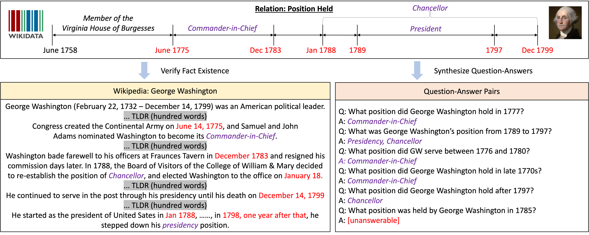

# Time-Sensitive-QA
The repo contains the dataset and code for paper [Time-Sensitive Question Answering dataset](https://arxiv.org/abs/2108.06314). The dataset is collected by UCSB NLP group and issued under MIT license.

This dataset is aimed to study the existing reading comprehension models' capability to perform temporal reasoning, and see whether they are sensitive to the temporal description in the given question. An example of annotated question-answer pairs are listed as follows:


## Repo Structure
- dataset/: this folder contains all the dataset
- dataset/annotated*: these files are the annotated (passage, time-evolving facts) by crowd-workers.
- dataset/train-dev-test: these files are synthesized using templates, including both easy and hard versions.
- BigBird/: all the running code for BigBird models
- FiD/: all the running code for fusion-in-decoder models

## Requirements
- [hydra 1.0.6](https://hydra.cc/docs/intro/)
- [omegaconf 2.1.0](https://github.com/omry/omegaconf)
1. BigBird-Specific Requirements
- [Transformers 4.8.2](https://github.com/huggingface/transformers)
- [Pytorch 1.8.1+cu102](https://pytorch.org/)
2. FiD-Specific Requirements
- [Transformers 3.0.2](https://github.com/huggingface/transformers)
- [Pytorch 1.6.0](https://pytorch.org/)

## BigBird
Extractive QA baseline model, first switch to the BigBird Conda environment:
### Initialize from NQ checkpoint
Running Training (Hard)
```
    python -m BigBird.main model_id=nq dataset=hard cuda=[DEVICE] mode=train per_gpu_train_batch_size=8
```

Running Evaluation (Hard)
```
    python -m BigBird.main model_id=nq dataset=hard cuda=[DEVICE] mode=eval model_path=[YOUR_MODEL]
```

### Initialize from TriviaQA checkpoint
Running Training (Hard)
```
    python -m BigBird.main model_id=triviaqa dataset=hard cuda=[DEVICE] mode=train per_gpu_train_batch_size=2
```

Running Evaluation (Hard)
```
    python -m BigBird.main model_id=triviaqa dataset=hard mode=eval cuda=[DEVICE] model_path=[YOUR_MODEL]
```

## Fusion-in Decoder
Generative QA baseline model, first switch to the FiD Conda environment:
### Initialize from NQ checkpoint
Running Training (Hard)
```
    python -m FiD.main mode=train dataset=hard model_path=/data2/wenhu/Time-Sensitive-QA/FiD/pretrained_models/nq_reader_base/
```

Running Evaluation (Hard)
```
    python -m FiD.main mode=eval cuda=3 dataset=hard model_path=[YOUR_MODEL] 
```

### Initialize from TriviaQA checkpoint
Running Training (Hard)
```
    python -m FiD.main mode=train dataset=hard model_path=/data2/wenhu/Time-Sensitive-QA/FiD/pretrained_models/tqa_reader_base/
```

Running Evaluation (Hard)
```
    python -m FiD.main mode=eval cuda=3 dataset=hard model_path=[YOUR_MODEL] 
```
